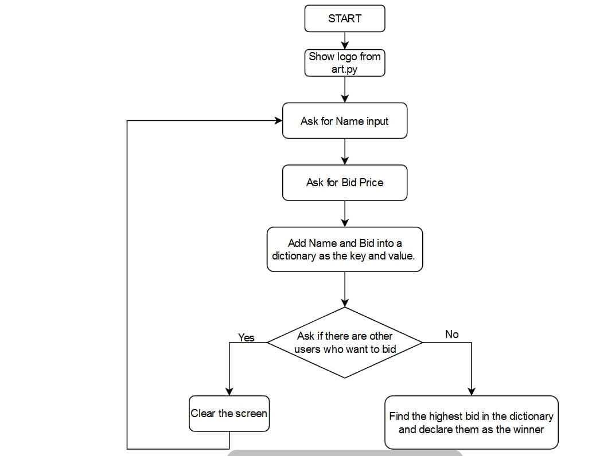

# 100 Days of Code: Python Pro Bootcamp for 2022

### Authors of  this Repository
- @armando-adorno Armando Adorno    https://armando-adorno.github.io/armando-adorno/    
- @Ghothis    Diony J. Adorno

## <b>Day 9: </b>Dictionaries, Nesting

##### <b>Project: </b>The Secret Auction Program

##### Exercises : <i>optional</i>

###### Exercise 1: Grading Program Instructions

 Access a dictionary of <code>student_scores</code> in the format of a dictionary. The <b>keys</b> in <code>student_scores</code> are the <b>names</b> of the students and the <b>values</b> are their exam <b>scores</b>.

Write a program that <b>converts their scores to grades.</b> By the end of the program, a new dictionary called <code>student_grades</code> that should contain student <b>names</b>
for <b>keys</b> and their <b>grades</b> for <b>values</b>. The <b>final version</b> of the <code>student_grades</code> dictionary will be checked.

<b>DO NOT</b> modify lines 1-7 to change the existing <code>student_scores</code> ditionary.

<b>DO NOT</b> write any print statements.

Scoring Criteria:

- Scores 91-100: Grade = "Outstanding"
- Scores 81-90: Grade = "Exceeds Expectations"
- Scores 71-80: Grade = "Acceptable"
- Scores 70 or lower: Grade = "Fail"

###### Exercise 2: Dictionary in List Instructions

 Write a program that adds to a <code>travel_log</code>. You can see a <code>travel_log</code> which is a <b>List</b> that contains 2 <b>Dictionaries.</b>

Write a function that will work with the following line of code on line 21 to add the entry for Russia to the <code>travel_log.
</code>

<b>DO NOT</b> modify the <code>travel_log</code> directly. You need to create a function that modifies it.

