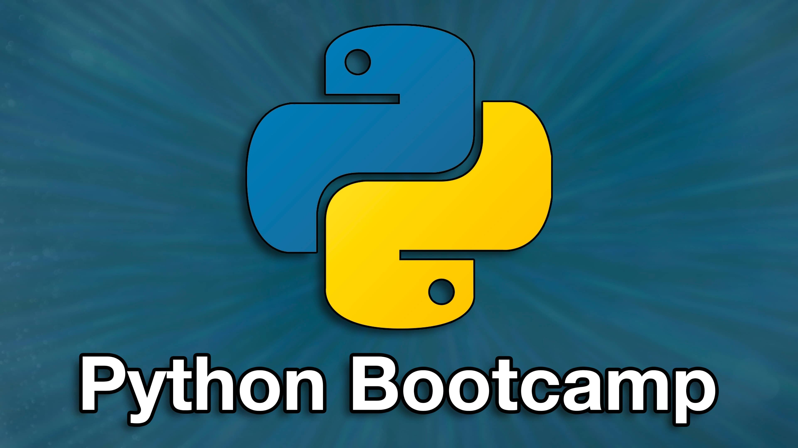

# 100 Days of Code: Python Pro Bootcamp 2022

## Caesar Cipher Project

##### Part 1
- Create a function called 'encrypt' that takes the 'text' and 'shift' as inputs.

- Inside the 'encrypt' function, shift each letter of the 'text' forwards in the alphabet by   the shift amount and print the encrypted text.

- Call the encrypt function and pass in the user inputs.You should be able to test the code and encrypt a message.
##### Part 2
- Create a different function called 'decrypt' that takes the 'text' and 'shift' as inputs.

- Inside the 'decrypt' function, shift each letter of the 'text' *backwards* in the alphabet by the shift amount and print the decrypted text.

- Check if the user wanted to encrypt or decrypt the message by checking the 'direction' variable. Then call the correct function based on that 'direction' variable. Then call the correct function based on that 'direction' variable. You should be able to test the code to encrypt *AND* decrypt a message.
##### Part 3
- Combine the encrypt() and decrypt() functions into a single function called caesar().

- Call the caesar() function, passing over the 'text', 'shift' and 'direction' values.

### Authors of  this Branch
- @armando-adorno Armando Adorno https://armando-adorno.github.io/armando-adorno/
